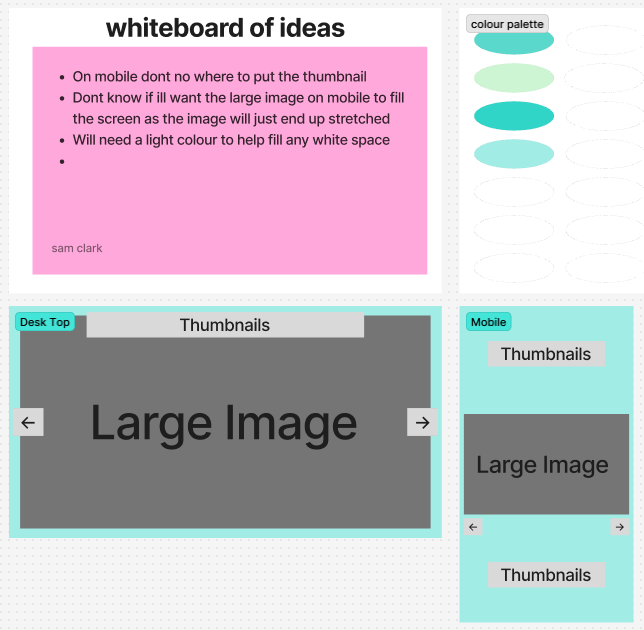

# Reflection

For this week's assignment, we're building a gallery, similar to the one we created in Week 2. However, this time we'll be using React to develop it. I'm really interested to see how building the same application with a new approach will differ from the previous one. It'll be a great opportunity to compare the two methods and better understand the advantages of using React.

# Requirements

- 🎯 Implement the useState hook to manage gallery state (e.g. selected image).
- 🎯 Use useEffect for initial fetching of images from an external API.
- 🎯 Return JSX from multiple components (e.g., an ImageItem component for each image and a Gallery component to display them).
- 🎯 Use the .map() function to render an array of images dynamically
- 🎯 Implement functionality to display a larger version of an image when its thumbnail is clicked.
- 🎯 Ensure all images have meaningful alt text.
- 🎯 Ensure basic keyboard navigation for image selection (e.g., thumbnails should be focusable and activatable with Enter/Space).

# Stretch Requirements

- 🏹 Use useEffect and the dependancy array to update the images when the user types in an input field.
- 🏹 Set up an Unsplash application that you can fetch from your React app.
- 🏹 Use .env to hide your API keys and tokens from the code.
- 🏹 Style the application excellently, using grid or flex and positioning.

# requirements that I wasn't able to achieve

....

# Wireframe

For this assignment, we've been asked to build an image gallery again, but this time with React. Because of that, my initial wireframe is quite simple—it’s the same design I used last time. I may end up changing it, though, as I work on the project. I'm still a bit unsure about a couple of the ideas I've sketched out and hope to have a clearer vision soon.

# Errors or Bugs I Encountered

....

# What went really well and what could have gone better?

....

# External sources

### Info

[My own repo](https://github.com/IndieMasco/TechEdSoftwareDeveloper021) , [Tech Ed repo](https://github.com/Tech-Educators/software-dev-021) , [FigJam](https://www.figma.com/board/JjN2Zgtoynrau06MjWJs6q/SD021?node-id=0-1&p=f&t=V1WCGcrmVKnoxJDr-0) , [MDN](https://developer.mozilla.org/en-US/) , [W3School](https://www.w3schools.com/) , [Template](https://github.com/Tech-Educators/software-dev-021/blob/main/demos/week6/week6-assignment/src/App.jsx)

### Examples

[MVP](https://basic-gallery-psi.vercel.app/) , [Stretch](https://great-images-iq88jjcm5-slouloudis.vercel.app/)
