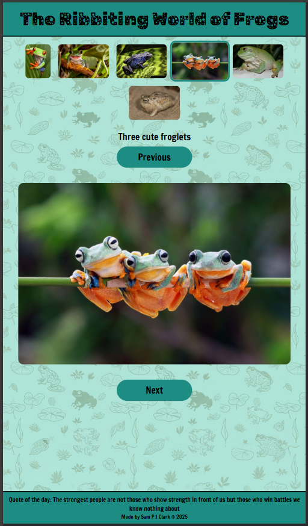
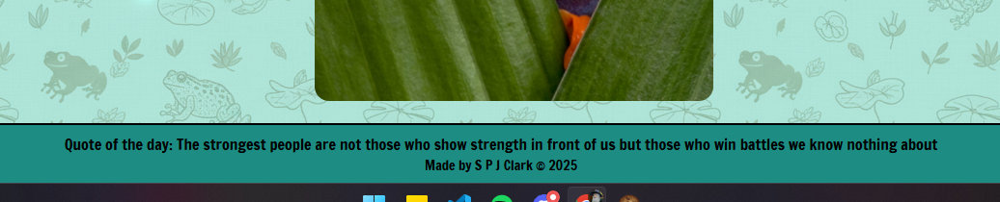
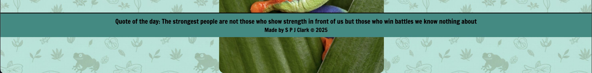
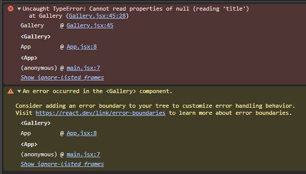
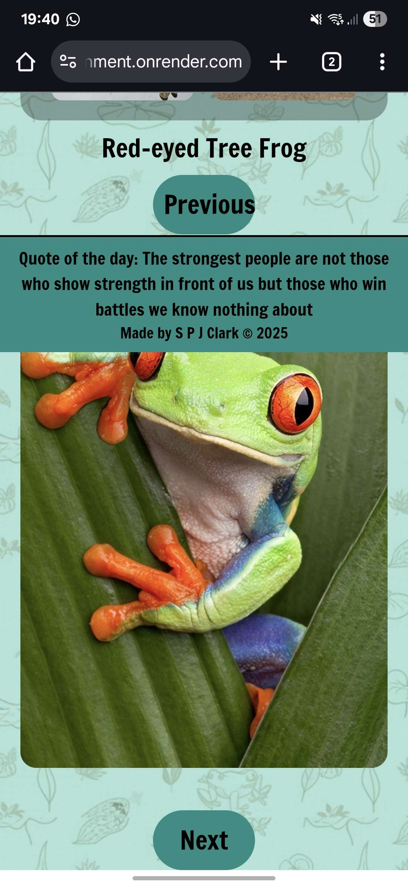

# Reflection

For this week's assignment, we're building a gallery, similar to the one we created in Week 2. However, this time we'll be using React to develop it. I'm really interested to see how building the same application with a new approach will differ from the previous one. It'll be a great opportunity to compare the two methods and better understand the advantages of using React.

I feel like I'm back at the beginning, learning JavaScript all over again. I just kept thinking of how to do things with vanilla JavaScript and forgetting that I'm using React. My brain kept hitting a wall when I tried to think of how I would go about doing it, so I ended up going through what we had done during the week and making notes of which lessons would help me start moving in the right direction.

I don't know how to feel about React and TailwindCSS at the moment. Splitting up the JavaScript into different files and styling with the JavaScript all just feels alien to me, as I'm used to doing things on three different files: index.html, style.css, and app.js. I'm sure I will get used to it the more we use React and TailwindCSS.

I had a little go at TailwindCSS within Footer.jsx. I can see the advantage of using it, but at the moment for me and my OCD, I like having all the CSS within its own file as it's a lot easier to find something and make any changes. Again, because this is new, I'm sure over time my mindset will change.

If there is anything you think I could do better or improve on, I'd be happy to listen and learn from what you have to say.

# Requirements

- ✅ 🎯 Implement the useState hook to manage gallery state (e.g. selected image)
- ✅ 🎯 Use useEffect for initial fetching of images from an external API
- ✅ 🎯 Use the .map() function to render an array of images dynamically
- ✅ 🎯 Implement functionality to display a larger version of an image when its thumbnail is clicked

  - All of the above have been done within Gallery.jsx

- ✅ 🎯 Ensure all images have meaningful alt text

  - I feel like this was already done for us; we just needed to make sure we pulled the alt text from the API

- ✅ 🎯 Return JSX from multiple components (e.g., an ImageItem component for each image and a Gallery component to display them)

  - Components i have - Gallery.jsx, Footer.jsx

- ✅ 🎯 Ensure basic keyboard navigation for image selection (e.g., thumbnails should be focusable and activatable with Enter/Space)

  - You can navigate the gallery using tab and select an image using enter or space

# Stretch Requirements

- ✅ 🏹 Use .env to hide your API keys and tokens from the code
  - I have got the API link within my `.env` file and within my Gallery.jsx im pulling the API with `const response = await fetch(import.meta.env.VITE_FROG_API);`
- ✅ 🏹 Style the application excellently, using grid or flex and positioning
  - personally i feel like i have Styled my gallery excellently
    - It works on both desktop and mobile
    - I've made sure the text is readable
    - I have gone for a more playful header font, but I still think it is readable
    - Everything is easy to see; I don't think anything blends in with each other

# requirements that I wasn't able to achieve

- ❌ 🏹 Set up an Unsplash application that you can fetch from your React app
- ❌ 🏹 Use useEffect and the dependancy array to update the images when the user types in an input field
  - These two stretch goals kinda go together. I can't really do the useEffect without doing the Unsplash first.

# Wireframe

For this assignment, we've been asked to build an image gallery again, but this time with React. Because of that, my initial wireframe is quite simple—it’s the same design I used last time. I may end up changing it, though, as I work on the project. I'm still a bit unsure about a couple of the ideas I've sketched out and hope to have a clearer vision soon.

The overall design changed a little as I was putting it all together. I didn't like how the images were so big on the page; it just didn't look very pleasing to the eye to me, so I made the images smaller. They are still big enough to be the main focus of the gallery, though.

I've added images of my wireframe and what it actually looks like on desktop and mobile so I can show what little changes I have made. There are still a couple of bits I want to play around with in CSS just to help finish off the styling.

<div align="center">
Wireframe


</div>

<div align="center">
Desk Top


</div>

<div align="center">
Mobile



</div>

# Errors or Bugs I Encountered

- I sent my gallery to Gabby to show her where I'm currently at, but for some reason, the footer is placed differently for each of us.
- After a quick Google search, the reason I've concluded is that we either have different screen resolutions or browser window sizes. Since I built my image gallery with a responsive design, its layout adapts to different screen sizes.
- How would I adjust for this in future projects?

<div align="center">
My view



</div>

<div align="center">
Gabbys view



</div>

- I had everything working Thursday evening with no errors, but when I loaded everything up the next day to continue working on it, nothing was showing on the page. I kept getting this error in my console (Image below). The way I found to solve it was to wrap the part that was throwing the error in `{selectedImage && ()}`. But why didn't I have this error Thursday evening, and it only appeared the next morning? I was speaking to Will and he said he had the same issue and solved it the same way.

<div align="center">



</div>

- Original code

```javascript
<div className="main-image-container">
  <h2>{selectedImage.title}</h2>
  
</div>
```

- New code

```javascript
{
  selectedImage && (
    <div className="main-image-container">
      <h2>{selectedImage.title}</h2>
      
    </div>
  );
}
```

# What went really well and what could have gone better?

- Not thinking I'm still using vanilla JavaScript 😂

- something
<div align="center">
test

 

</div>

# External sources

### Info

[My own repo](https://github.com/IndieMasco/TechEdSoftwareDeveloper021) , [Tech Ed repo](https://github.com/Tech-Educators/software-dev-021) , [FigJam](https://www.figma.com/board/JjN2Zgtoynrau06MjWJs6q/SD021?node-id=0-1&p=f&t=V1WCGcrmVKnoxJDr-0) , [MDN](https://developer.mozilla.org/en-US/) , [W3School](https://www.w3schools.com/) , [Template](https://github.com/Tech-Educators/software-dev-021/blob/main/demos/week6/week6-assignment/src/App.jsx)
